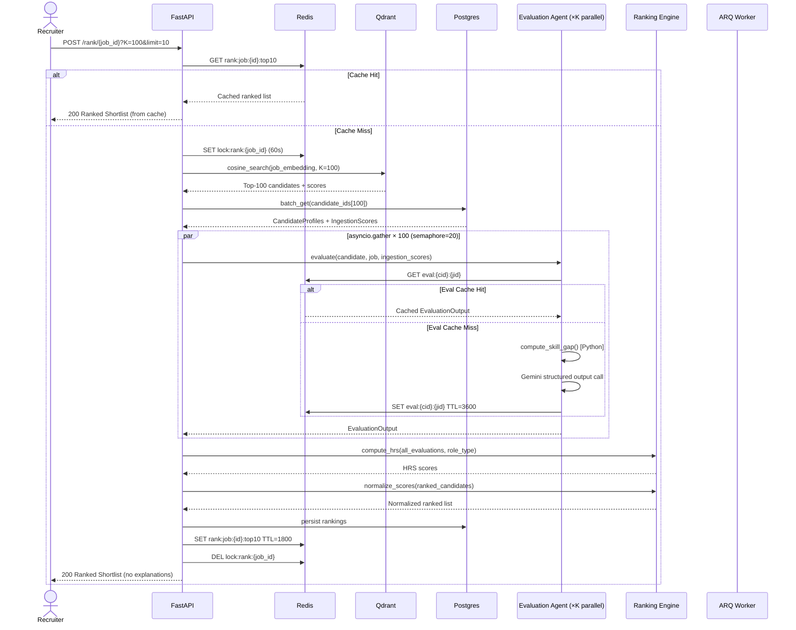
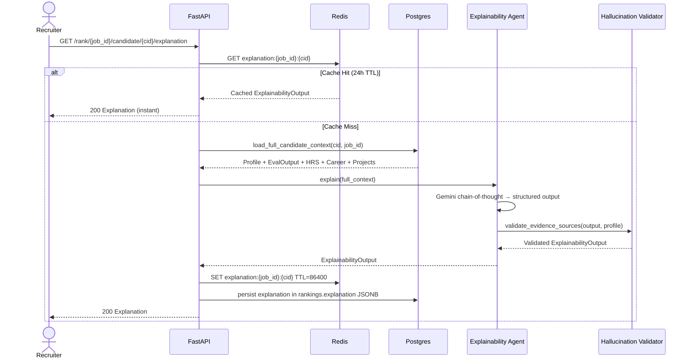
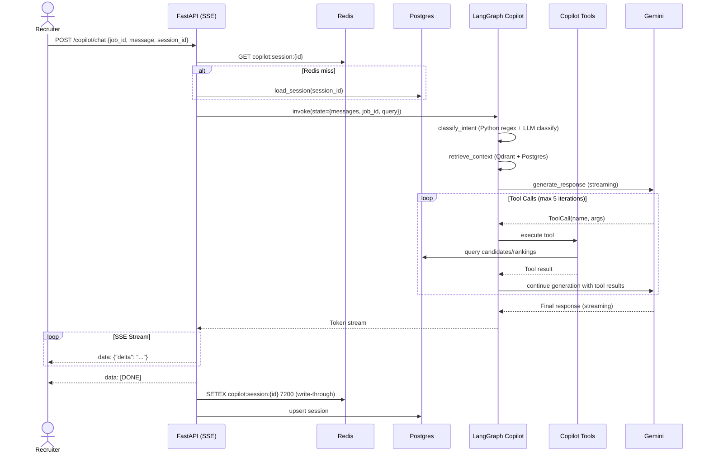

# NEXUS — Multi-Agent Architecture
### Principal AI Architect Review | v2.0 | 2026

> **Scope:** This document covers ONLY the agent architecture.  
> Product vision, API spec, database schema, and Docker config are in the companion Architecture Review document.  
> Every decision below has a technical justification. No architectural choices are made for aesthetics.

---

## 0. Architecture Decision Record: Why Five Agents?

Before specifying anything, the most important decision is how many agents to have and why.

The original documentation specifies **10 agents**. This section collapses that to **5 agents + 1 deterministic engine**. Here is the reasoning for every merge and every split.

### 0.1 The Merge Analysis

| Original Agent | Decision | Reason |
|---|---|---|
| Job Intelligence Agent | **KEEP separate** | Different input (raw text), different reasoning task, runs at ingestion time only. No overlap with anything. |
| Resume Intelligence Agent | **MERGE into Candidate Intelligence** | One LLM call for entity extraction. Splitting into a "Resume Agent" vs downstream analyzers is a code organization decision, not an agent boundary. |
| Skill Intelligence Agent | **DEMOTE to Python module** | Ontology matching is a graph BFS + cosine similarity operation. Not an LLM task. Zero reasoning required. |
| Project Intelligence Agent | **DEMOTE to Python module** | Heuristic scoring (scale signals, production flag, tech depth). Not a reasoning problem. |
| Career Intelligence Agent | **DEMOTE to Python module** | Date math + formula. No reasoning needed. |
| Behavioral Intelligence Agent | **DEMOTE to Python module** | Formula over structured fields. |
| Authenticity Verification Agent | **DEMOTE to Python module** | Set intersection + evidence counting. |
| Growth Potential Agent | **DEMOTE to Python module** | Weighted sum over already-computed scores. |
| Recruiter Agent + HM Agent | **MERGE into Evaluation Agent** | Same input. Same LLM context. Different "personas" in the system prompt is NOT a sufficient reason to make two API calls. One call returns both views. |
| Behavioral Agent (ranking-time) | **MERGE into Evaluation Agent** | The behavioral engagement signal is one field in the evaluation — not a separate agent. |
| Explainability Agent | **KEEP separate** | Different execution time (post-ranking), different input (ranked position + full scores), different purpose (human narrative, not score). Strict separation prevents the explanation from influencing the rank. |
| Recruiter Copilot | **KEEP separate** | Fundamentally different architecture (stateful LangGraph, RAG, tool-calling, SSE streaming). Not part of the ranking pipeline at all. |

### 0.2 Final Agent Roster

```
┌──────────────────────────────────────────────────────────────────────┐
│                     NEXUS AGENT ROSTER (v2.0)                        │
├────┬──────────────────────────────┬────────────┬─────────────────────┤
│ #  │ Agent                        │ LLM Calls  │ When                │
├────┼──────────────────────────────┼────────────┼─────────────────────┤
│ A1 │ Job Intelligence Agent       │ 1 per JD   │ Ingestion-time      │
│ A2 │ Candidate Intelligence Agent │ 1 per CV   │ Ingestion-time      │
│ A3 │ Evaluation Agent             │ 1 per pair │ Query-time          │
│ R0 │ Ranking Engine               │ 0 (Python) │ Query-time          │
│ A4 │ Explainability Agent         │ 1 per view │ On-demand (lazy)    │
│ A5 │ Recruiter Copilot            │ 1-4 / msg  │ User-initiated      │
└────┴──────────────────────────────┴────────────┴─────────────────────┘
```

**Total LLM calls for a ranking job over K=100 candidates:**
- A1: 1 (already cached at JD creation)
- A2: Already paid at upload (cached per resume hash)
- A3: 100 (parallelized via asyncio.gather, semaphore=20)
- R0: 0
- A4: ~5 (lazy, only when recruiter views a candidate)
- **Hot path: 101 calls. Down from 800.**

---

## 1. Agent Contract Protocol

Before any agent specification: the contract is the API. Once contracts are frozen, agents can be built independently by different team members without coordination.

### 1.1 Base Contract Definition

```python
# agents/base.py

from __future__ import annotations
from abc import ABC, abstractmethod
from enum import Enum
from typing import Generic, TypeVar
from pydantic import BaseModel, Field
import asyncio

TInput = TypeVar("TInput", bound=BaseModel)
TOutput = TypeVar("TOutput", bound=BaseModel)


class RetryPolicy(BaseModel):
    max_attempts: int = 3
    initial_delay_seconds: float = 1.0
    backoff_multiplier: float = 2.0       # Exponential backoff
    max_delay_seconds: float = 10.0
    retryable_exceptions: list[str] = ["GeminiRateLimitError", "GeminiTimeoutError", "httpx.TimeoutException"]


class AgentStatus(str, Enum):
    SUCCESS = "success"
    PARTIAL = "partial"      # Some sub-components failed, core result valid
    FAILED = "failed"        # Complete failure; downstream uses fallback
    CACHED = "cached"        # Result served from cache


class AgentResult(BaseModel, Generic[TOutput]):
    status: AgentStatus
    output: TOutput | None
    confidence: float = Field(ge=0.0, le=1.0)   # Agent's self-assessed confidence
    latency_ms: int
    model_used: str | None = None
    tokens_used: int = 0
    cache_hit: bool = False
    error_message: str | None = None
    fallback_used: bool = False


class AgentContract(ABC, Generic[TInput, TOutput]):
    """
    The typed API between agents.
    Implement this to build any NEXUS agent independently.
    """
    
    # Identity
    agent_name: str
    agent_version: str = "1.0.0"
    
    # Contract metadata
    input_schema: type[TInput]
    output_schema: type[TOutput]
    dependencies: list[str]           # Agent names this agent depends on
    tools: list[str]                  # External service dependencies
    
    # Operational constraints
    timeout_seconds: int
    retry_policy: RetryPolicy
    
    @abstractmethod
    async def execute(self, input_data: TInput) -> AgentResult[TOutput]:
        """Core execution logic. Must handle its own timeout and retry."""
        ...
    
    @abstractmethod
    async def get_fallback(self, input_data: TInput) -> TOutput:
        """
        Called when all retries are exhausted.
        Must return a valid TOutput with neutral/default values.
        NEVER raise an exception — the pipeline continues.
        """
        ...
    
    async def run(self, input_data: TInput) -> AgentResult[TOutput]:
        """
        Public entry point. Handles: validation → execute → retry → fallback → log.
        Do not override this method.
        """
        validated = self.input_schema.model_validate(input_data.model_dump())
        
        for attempt in range(self.retry_policy.max_attempts):
            try:
                result = await asyncio.wait_for(
                    self.execute(validated),
                    timeout=self.timeout_seconds
                )
                await self._log(validated, result)
                return result
            except Exception as e:
                delay = min(
                    self.retry_policy.initial_delay_seconds * (self.retry_policy.backoff_multiplier ** attempt),
                    self.retry_policy.max_delay_seconds
                )
                if attempt < self.retry_policy.max_attempts - 1:
                    await asyncio.sleep(delay)
        
        # All retries exhausted
        fallback = await self.get_fallback(validated)
        return AgentResult(
            status=AgentStatus.FAILED,
            output=fallback,
            confidence=0.0,
            latency_ms=self.timeout_seconds * 1000,
            fallback_used=True,
            error_message="All retry attempts exhausted",
        )
    
    async def _log(self, input_data: TInput, result: AgentResult) -> None:
        """Override to add agent-specific logging. Base logs to structlog."""
        import structlog
        log = structlog.get_logger()
        log.info(
            "agent_execution_complete",
            agent=self.agent_name,
            status=result.status,
            confidence=result.confidence,
            latency_ms=result.latency_ms,
            tokens=result.tokens_used,
            cache_hit=result.cache_hit,
        )
```

### 1.2 Registered Agent Contracts

```python
# agents/registry.py
# Every agent registers itself here. This is the single source of truth for all contracts.

AGENT_REGISTRY = {
    "job_intelligence":      JobIntelligenceContract,
    "candidate_intelligence": CandidateIntelligenceContract,
    "evaluation":            EvaluationContract,
    "explainability":        ExplainabilityContract,
    "recruiter_copilot":     RecruiterCopilotContract,
}

# Runtime contract validation at startup
def validate_contracts():
    for name, contract in AGENT_REGISTRY.items():
        assert hasattr(contract, "input_schema"), f"{name} missing input_schema"
        assert hasattr(contract, "output_schema"), f"{name} missing output_schema"
        assert hasattr(contract, "timeout_seconds"), f"{name} missing timeout_seconds"
```

---

## 2. Agent A1: Job Intelligence Agent

### 2.1 Purpose

Transform a raw job description string into a `JobProfile` — a structured, embedding-ready, reasoning-ready object. This agent runs **once per JD**, at ingestion time. Its output is stored in PostgreSQL and cached by JD content hash. It never runs again for the same JD text.

**Why this is its own agent:** The input (raw text) and the reasoning task (extract explicit + implicit requirements, detect cultural signals, identify anti-patterns) are fundamentally different from any candidate-related reasoning. This agent is about decoding employer intent — a distinct problem domain.

### 2.2 Contract

```python
# agents/job_intelligence/schemas.py

from pydantic import BaseModel, Field
from typing import Literal, Optional


class JobIntelligenceInput(BaseModel):
    raw_jd: str = Field(min_length=100, description="Raw job description text")
    tenant_id: str
    role_type_hint: Optional[Literal["research", "leadership", "junior", "devops", "default"]] = None


class HiddenExpectation(BaseModel):
    expectation: str            # e.g. "Production ownership mindset"
    evidence: str               # What in the JD text suggests this
    importance: Literal["critical", "high", "medium"]


class RedFlag(BaseModel):
    flag: str                   # e.g. "Excessive meeting culture"
    evidence: str
    candidate_signal: str       # What candidate signal would trigger this flag


class JobProfile(BaseModel):
    # Explicit requirements
    required_skills: list[str] = Field(description="Must-have skills, extracted explicitly")
    preferred_skills: list[str] = Field(description="Nice-to-have skills")
    min_experience_years: int
    max_experience_years: Optional[int] = None
    
    # Role classification
    role_type: Literal["research", "leadership", "junior", "devops", "default"]
    seniority_tier: int = Field(ge=1, le=5, description="1=intern, 5=principal/staff")
    domain: str                 # e.g. "machine learning", "backend", "devops"
    industry: str               # e.g. "fintech", "healthcare", "saas"
    
    # Semantic context
    role_objectives: list[str] = Field(description="What success looks like in this role")
    key_responsibilities: list[str] = Field(description="Primary job functions for project matching")
    soft_skills: list[str]
    
    # Intelligence layer (LLM-extracted insights)
    hidden_expectations: list[HiddenExpectation] = Field(
        description="Implicit requirements not stated explicitly in JD"
    )
    red_flags: list[RedFlag] = Field(
        description="Candidate signals that would make this a poor fit"
    )
    culture_signals: list[str] = Field(
        description="Observable culture preferences from JD language"
    )
    
    # Ranking configuration
    suggested_role_weights: dict[str, float] = Field(
        description="Agent-suggested weight overrides for this specific role"
    )
    
    # Metadata
    extraction_confidence: float = Field(ge=0.0, le=1.0)
    jd_quality_score: float = Field(ge=0.0, le=1.0, description="How well-written the JD is")


class JobIntelligenceOutput(BaseModel):
    job_profile: JobProfile
    embedding_text: str         # Optimized text for BGE-M3 embedding (not raw JD)
    warnings: list[str]         # e.g. "JD is very short; extraction confidence reduced"
```

### 2.3 Implementation Contract

```python
class JobIntelligenceContract(AgentContract[JobIntelligenceInput, JobIntelligenceOutput]):
    agent_name = "job_intelligence"
    input_schema = JobIntelligenceInput
    output_schema = JobIntelligenceOutput
    dependencies = []                              # No upstream agents
    tools = ["gemini_structured_output", "redis_cache"]
    timeout_seconds = 30
    retry_policy = RetryPolicy(max_attempts=3, initial_delay_seconds=1.0)
```

### 2.4 Prompt Strategy

**File:** `agents/job_intelligence/prompt.md`

```markdown
# Job Intelligence Agent — System Prompt

You are a Principal Technical Recruiter with 15+ years of hiring experience 
across FAANG, Series B startups, and enterprise software companies.

Your task is to analyze a job description and produce a structured JSON profile 
that captures BOTH what the employer wrote AND what they actually need.

## Rules

**EXPLICIT extraction:**
- Extract only skills explicitly mentioned. Do not infer skills not in the text.
- If minimum experience is stated as a range ("5-8 years"), use the minimum.

**IMPLICIT extraction (hidden_expectations):**
- Read between the lines. "Fast-paced environment" means delivery pressure.
- "Wear many hats" means understaffed team — candidate must be self-directed.
- "Executive visibility" means communication skills at VP/C-suite level are required.
- For each hidden expectation, quote the specific phrase that implies it.

**Red flags:**
- These are NOT about the company. They are about CANDIDATE signals that would fail this role.
- Example: If JD emphasizes "deep ownership", then "frequent job switching" is a red flag.

**Role type classification:**
- research: published papers, novel algorithms, PhDs preferred
- leadership: team management, P&L ownership, stakeholder alignment
- junior: learning signals, mentorship mentions, fundamentals focus
- devops: infrastructure, CI/CD, reliability, on-call mentioned
- default: generalist engineering role

**Confidence:**
- JD under 200 words: extraction_confidence <= 0.5
- JD under 100 words: extraction_confidence <= 0.3
- Well-structured JD with clear sections: extraction_confidence >= 0.85

## Output
Return ONLY valid JSON matching the JobProfile schema. No prose, no markdown.
```

### 2.5 Caching Strategy

```python
cache_key = f"job_intel:{sha256(raw_jd.encode()).hexdigest()}"
TTL = 86400  # 24 hours — same JD text always produces same profile
```

### 2.6 Fallback Behavior

On total failure (all 3 retries exhausted), the agent returns a `JobProfile` constructed by:
1. Regex-extracted skills (keyword matching against known skill vocabulary)
2. `extraction_confidence = 0.2`
3. `role_type = "default"` (neutral weights)
4. `warnings = ["LLM extraction failed; using keyword fallback"]`

JD creation succeeds. The recruiter sees a warning banner. Ranking still works (just less accurately for hidden expectations).

### 2.7 Latency Budget

| Step | Expected | P99 |
|---|---|---|
| Cache check (Redis) | 2ms | 5ms |
| Gemini structured output call | 1,200ms | 2,800ms |
| Schema validation (Pydantic) | 1ms | 3ms |
| PostgreSQL persist | 10ms | 30ms |
| Qdrant embedding + upsert | 150ms | 300ms |
| **Total (cache miss)** | **~1.4s** | **~3.1s** |
| **Total (cache hit)** | **<15ms** | **<30ms** |

### 2.8 Example

**Input:**
```json
{
  "raw_jd": "We're hiring a Senior ML Engineer to join our AI Platform team. You'll build and scale production ML systems serving 10M+ users. Requirements: 5+ years ML experience, Python, PyTorch or TensorFlow, experience with MLOps (Kubeflow, MLflow), strong understanding of distributed training. Nice to have: Kubernetes, Go. You'll work directly with the CTO and present to the board quarterly.",
  "tenant_id": "t-001",
  "role_type_hint": null
}
```

**Output:**
```json
{
  "job_profile": {
    "required_skills": ["Python", "PyTorch", "TensorFlow", "MLOps", "Kubeflow", "MLflow", "distributed training"],
    "preferred_skills": ["Kubernetes", "Go"],
    "min_experience_years": 5,
    "role_type": "research",
    "seniority_tier": 4,
    "domain": "machine learning",
    "industry": "saas",
    "role_objectives": ["Scale production ML systems to 10M+ users", "Own ML platform architecture"],
    "hidden_expectations": [
      {
        "expectation": "Executive communication skills — board-level presentation required",
        "evidence": "present to the board quarterly",
        "importance": "critical"
      },
      {
        "expectation": "Direct CTO collaboration — high visibility, high accountability",
        "evidence": "work directly with the CTO",
        "importance": "high"
      }
    ],
    "red_flags": [
      {
        "flag": "No production ML deployment experience",
        "evidence": "10M+ users implies large-scale system experience required",
        "candidate_signal": "All projects listed as research or prototype only"
      }
    ],
    "extraction_confidence": 0.88
  }
}
```

### 2.9 Tests

```python
# agents/job_intelligence/tests/test_job_intelligence.py

async def test_extracts_hidden_expectations():
    jd = "Senior Engineer. Present to board quarterly. Work with CTO directly."
    result = await job_intelligence_agent.run(JobIntelligenceInput(raw_jd=jd, tenant_id="t-1"))
    assert any("board" in exp.evidence for exp in result.output.job_profile.hidden_expectations)

async def test_short_jd_reduces_confidence():
    jd = "Hire engineer. Python. 5 years."
    result = await job_intelligence_agent.run(JobIntelligenceInput(raw_jd=jd, tenant_id="t-1"))
    assert result.output.job_profile.extraction_confidence <= 0.5

async def test_fallback_on_llm_failure(mock_gemini_failure):
    result = await job_intelligence_agent.run(JobIntelligenceInput(raw_jd="..." * 50, tenant_id="t-1"))
    assert result.status == AgentStatus.FAILED
    assert result.fallback_used == True
    assert result.output is not None       # Fallback always returns something

async def test_cache_hit_returns_immediately(populated_redis):
    # Same JD content → cache hit
    result = await job_intelligence_agent.run(...)
    assert result.cache_hit == True
    assert result.latency_ms < 30
```

---

## 3. Agent A2: Candidate Intelligence Agent

### 3.1 Purpose

Transform a parsed resume (text from Docling) into a complete, scored `CandidateIntelligenceOutput`. This is the most complex agent in the system — but complexity is **contained inside the agent**, not spread across multiple agents.

**Architecture decision — internal modules vs separate agents:**

This agent uses **one LLM call** (entity extraction) and **five pure-Python analyzers**. The analyzers are NOT agents. They do not call LLMs. They are deterministic functions over the structured data the LLM extracted. Calling them "agents" would be misleading — they are analyzers, scorers, validators. The internal architecture is:

```
CandidateIntelligenceAgent
│
├── [LLM] EntityExtractor
│       One Gemini call → extracts all structured entities from raw text
│
├── [Python] SkillAnalyzer
│       Ontology graph BFS + BGE-M3 fallback → skill depth + confidence map
│
├── [Python] CareerAnalyzer
│       Date math + progression formulas → trajectory scores
│
├── [Python] ProjectAnalyzer
│       Heuristic scoring → complexity, production signals, tech depth
│
├── [Python] AuthenticityAnalyzer
│       Set intersection + evidence counting → confidence per skill claim
│
└── [Python] GrowthAnalyzer
        Weighted formula over career + project + behavioral signals
```

**Why one LLM call, not five:** All five analyzers operate on the SAME structured data extracted by EntityExtractor. Running five LLM calls to analyze the same resume fields is redundant token spending with no accuracy benefit. The LLM's job is to convert unstructured text to structured data — once. Python's job is to score structured data — deterministically, cheaply, repeatably.

This agent runs **once per resume upload** and results are stored permanently in PostgreSQL. The same candidate applying to five different jobs never triggers this agent again.

### 3.2 Internal Module: EntityExtractor

```python
# agents/candidate_intelligence/modules/entity_extractor.py

class EntityExtractorInput(BaseModel):
    resume_text: str = Field(min_length=50)

class WorkEntry(BaseModel):
    title: str
    company: str
    company_tier: Literal["startup", "mid_market", "enterprise", "faang"] | None = None
    start_date: str                       # "2022-03" or "2022"
    end_date: str | None                  # None = current role
    is_current: bool
    duration_months: int                  # Computed by extractor
    responsibilities: list[str]           # What they did
    achievements: list[str]               # Measurable outcomes
    scope_signals: list[str]              # Evidence of ownership/leadership scope
    domain: str                           # e.g. "backend", "ML", "data engineering"

class Project(BaseModel):
    title: str
    description: str
    tech_stack: list[str]
    scale_mention: str | None             # Raw text about scale e.g. "10M requests/day"
    business_impact: str | None           # Raw text about impact
    project_type: Literal["academic", "personal", "professional", "open_source", "hackathon"]
    is_production: bool                   # Agent's assessment from description
    complexity_signals: list[str]         # Raw phrases suggesting complexity

class CertEntry(BaseModel):
    name: str
    issuer: str
    date_obtained: str | None
    expiry_date: str | None

class EducationEntry(BaseModel):
    degree: str
    field: str
    institution: str
    graduation_year: int | None
    gpa: float | None

class ActivitySignals(BaseModel):
    github_url: str | None
    linkedin_url: str | None
    publications: list[str]
    open_source_contributions: list[str]
    blog_url: str | None
    profile_last_updated: str | None      # ISO date if extractable

class ExtractedEntities(BaseModel):
    skills_claimed: list[str]             # Raw skill strings as written in resume
    work_history: list[WorkEntry]
    education: list[EducationEntry]
    projects: list[Project]
    certifications: list[CertEntry]
    activity_signals: ActivitySignals
    ambiguous_claims: list[str]           # Items LLM flagged as vague/unverifiable
    total_experience_months: int          # Sum of all work history durations
```

**EntityExtractor Prompt:**
```markdown
# Entity Extractor — System Prompt

You are a technical CV parsing engine. Your job is structured data extraction only.

Rules:
1. EXTRACT only what is written. Never infer or assume.
2. For duration_months: compute the integer month count from start to end date.
   If only years given (2019-2022), assume Jan-Dec → 36 months.
3. For is_production: mark true only if the description mentions deployment,
   real users, live system, production traffic, or business usage.
4. For company_tier:
   - faang: Google, Meta, Amazon, Apple, Netflix, Microsoft, OpenAI, Anthropic, Stripe, Databricks
   - enterprise: companies with >1000 employees not in faang list
   - mid_market: 50-1000 employees
   - startup: <50 employees or explicitly described as startup/early stage
5. For ambiguous_claims: flag any skill or achievement that is stated without any 
   supporting context ("Expert in Python" with no projects using Python → flag it).

Return ONLY valid JSON. No prose.
```

### 3.3 Internal Module: SkillAnalyzer

```python
# agents/candidate_intelligence/modules/skill_analyzer.py
# NO LLM. Pure Python + NetworkX + BGE-M3 (for unknown skills only).

class SkillMatch(BaseModel):
    claimed_skill: str
    confidence: float           # 0-1: how strongly evidenced this skill is
    evidence: list[str]         # List of evidence sources
    ontology_aliases: list[str] # Known equivalents (Kafka → Message Queues)
    depth_tier: Literal["expert", "proficient", "familiar", "mentioned_only"]

class SkillAnalysis(BaseModel):
    skill_map: dict[str, SkillMatch]     # keyed by normalized skill name
    top_skills: list[str]                # Top 10 by confidence, ordered
    domains: list[str]                   # Inferred domain coverage
    skill_breadth: float                 # 0-1: coverage across tech domains
    skill_depth: float                   # 0-1: avg confidence of top-10 skills

def analyze_skills(entities: ExtractedEntities, ontology: nx.DiGraph) -> SkillAnalysis:
    skill_map = {}
    for skill in entities.skills_claimed:
        # Check evidence across all profile sections
        evidence = []
        for proj in entities.projects:
            if skill_in_text(skill, proj.tech_stack + [proj.description]):
                evidence.append(f"Project: {proj.title}")
        for role in entities.work_history:
            if skill_in_text(skill, role.responsibilities + role.achievements):
                evidence.append(f"Role: {role.title} at {role.company}")
        for cert in entities.certifications:
            if skill_covered_by_cert(skill, cert.name):
                evidence.append(f"Cert: {cert.name}")
        
        # Confidence = evidence × recency weight
        recency = compute_recency_weight(skill, entities.work_history)
        base_confidence = min(len(evidence) * 0.25, 0.90)
        confidence = round(base_confidence * recency, 2)
        
        # Depth tier
        if confidence >= 0.75:   tier = "expert"
        elif confidence >= 0.50: tier = "proficient"
        elif confidence >= 0.25: tier = "familiar"
        else:                    tier = "mentioned_only"
        
        # Ontology expansion (pure graph lookup)
        aliases = get_ontology_aliases(skill, ontology)
        
        skill_map[normalize_skill(skill)] = SkillMatch(
            claimed_skill=skill, confidence=confidence,
            evidence=evidence, ontology_aliases=aliases, depth_tier=tier
        )
    
    return SkillAnalysis(
        skill_map=skill_map,
        top_skills=sorted(skill_map, key=lambda s: skill_map[s].confidence, reverse=True)[:10],
        domains=infer_domains(skill_map, ontology),
        skill_breadth=compute_breadth(skill_map, ontology),
        skill_depth=mean([m.confidence for m in skill_map.values()][:10]) if skill_map else 0.0,
    )
```

### 3.4 Internal Module: CareerAnalyzer

```python
# agents/candidate_intelligence/modules/career_analyzer.py
# NO LLM. Pure date math and progression formulas.

class CareerAnalysis(BaseModel):
    total_experience_months: int
    avg_tenure_months: float
    tenure_stability_score: float       # 0-1: formula driven
    job_hopping_risk: float             # 0-1: ratio of short stints
    progression_score: float            # 0-1: upward movement quality
    promotion_velocity: float           # Seniority tier delta / year
    domain_depth_score: float           # 0-1: concentration in primary domain
    leadership_growth_signals: int      # Count of scope-expansion phrases
    career_phase: Literal["early", "growth", "senior", "leadership"]
    red_flags: list[str]                # Detected anti-patterns
    career_highlights: list[str]        # Strongest positive signals

def analyze_career(entities: ExtractedEntities) -> CareerAnalysis:
    history = sorted(entities.work_history, key=lambda r: r.start_date)
    
    if not history:
        return CareerAnalysis(...)     # Return zero-scored defaults
    
    # Tenure stability (weighted by recency)
    tenure_weights = compute_recency_weights(history)
    avg_tenure = weighted_mean([r.duration_months for r in history], tenure_weights)
    stability = clip(avg_tenure / 24.0, 0.0, 1.0)     # 24 months → 1.0
    
    # Job hopping risk
    short_stints = [r for r in history if r.duration_months < 12]
    # Exception: startup that raised/exited → reduce penalty
    adjusted_short = [r for r in short_stints if r.company_tier not in ("startup",)]
    hopping_risk = len(adjusted_short) / max(len(history), 1)
    
    # Progression detection
    seniority_levels = [infer_seniority_tier(r.title) for r in history]
    if len(seniority_levels) >= 2:
        slope = linear_slope(list(range(len(seniority_levels))), seniority_levels)
        progression = clip((slope + 1) / 2, 0.0, 1.0)  # normalize
    else:
        progression = 0.5
    
    # Red flags
    flags = []
    if consecutive_short_stints(history, threshold_months=12, count=2):
        flags.append("Two or more consecutive roles under 12 months")
    if declining_seniority(seniority_levels):
        flags.append("Title regression detected in career history")
    if domain_fragmentation(history, unique_domains_threshold=4, years=5):
        flags.append("Excessive domain switching — 4+ domains in 5 years")
    
    return CareerAnalysis(
        total_experience_months=entities.total_experience_months,
        avg_tenure_months=avg_tenure,
        tenure_stability_score=stability,
        job_hopping_risk=hopping_risk,
        progression_score=progression,
        red_flags=flags,
        ...
    )
```

### 3.5 Internal Module: ProjectAnalyzer

```python
class ProjectScore(BaseModel):
    title: str
    complexity_score: float        # 0-10
    is_production: bool
    scale_tier: Literal["toy", "small", "medium", "large", "hyperscale"]
    tech_depth: float              # 0-1: distinct architectural layers
    business_impact_detected: bool
    ownership_level: Literal["contributor", "lead", "owner", "architect"]
    project_type_penalty: float    # Applied for academic/tutorial projects

def score_project(project: Project) -> ProjectScore:
    score = 0.0
    
    # Scale scoring (parse scale_mention string)
    scale = parse_scale(project.scale_mention)          # returns Literal tier
    score += {"toy": 0, "small": 1.0, "medium": 2.0, "large": 3.0, "hyperscale": 4.0}[scale]
    
    # Production signal
    if project.is_production: score += 2.0
    
    # Tech depth (distinct architectural layers: DB + API + cache + queue = 4 layers)
    layers = classify_tech_layers(project.tech_stack)
    score += min(len(layers) * 0.5, 2.0)
    
    # Business impact
    if project.business_impact: score += 1.5
    
    # Complexity signals (keywords indicating non-trivial problems)
    advanced_signals = ["distributed", "concurrent", "fault-tolerant", "sub-millisecond", 
                        "high-availability", "multi-tenant", "sharding", "consensus"]
    score += sum(0.3 for sig in advanced_signals if any(sig in c.lower() for c in project.complexity_signals))
    
    # Penalties
    penalty = 0.0
    if project.project_type == "academic": penalty = 2.0
    if project.project_type == "hackathon": penalty = 1.0
    
    return ProjectScore(
        complexity_score=clip(score - penalty, 0.0, 10.0),
        scale_tier=scale,
        ...
    )
```

### 3.6 Internal Module: AuthenticityAnalyzer & GrowthAnalyzer

```python
# AuthenticityAnalyzer — Pure set intersection. No LLM.
# (Implemented inline in SkillAnalyzer — the confidence field IS the authenticity score)
# Authenticity is not a separate module; it's the output of SkillAnalyzer.evidence counting.
# This eliminates a separate agent entirely.

# GrowthAnalyzer — Weighted sum of already-computed scores. No LLM.

class GrowthScore(BaseModel):
    growth_potential: float             # 0-100
    trajectory_direction: Literal["up", "flat", "down"]
    upskilling_velocity: float          # Certs per year (last 3 years)
    time_to_senior_estimate_months: int | None

def score_growth(career: CareerAnalysis, skill: SkillAnalysis, 
                 projects: list[ProjectScore], behavioral: ActivitySignals) -> GrowthScore:
    
    # Project complexity trend (slope over chronological projects)
    project_scores = [p.complexity_score for p in projects]
    complexity_slope = linear_slope(list(range(len(project_scores))), project_scores) if len(project_scores) >= 2 else 0.0
    complexity_trend = clip((complexity_slope + 10) / 20, 0.0, 1.0)   # normalize
    
    # Certification velocity
    cert_velocity_raw = compute_cert_velocity(behavioral, years=3)
    cert_velocity = min(cert_velocity_raw / 2.0, 1.0)    # 2 certs/year = 1.0
    
    # Title acceleration
    title_accel = clip(career.promotion_velocity / 2.0, 0.0, 1.0)
    
    # Behavioral engagement
    behavioral_eng = compute_behavioral_engagement(behavioral)
    
    gp = (
        0.40 * complexity_trend +
        0.30 * cert_velocity +
        0.20 * title_accel +
        0.10 * behavioral_eng
    )
    
    return GrowthScore(
        growth_potential=round(gp * 100, 2),
        trajectory_direction="up" if gp > 0.65 else "flat" if gp > 0.40 else "down",
        upskilling_velocity=cert_velocity_raw,
        time_to_senior_estimate_months=estimate_senior_timeline(career),
    )
```

### 3.7 Full Output Schema

```python
class CandidateIntelligenceOutput(BaseModel):
    # Raw extracted entities
    entities: ExtractedEntities
    
    # Analyzed scores (all pure Python, all ingestion-time)
    skill_analysis: SkillAnalysis
    career_analysis: CareerAnalysis
    project_scores: list[ProjectScore]
    growth_score: GrowthScore
    
    # Composite ingestion-time scores (pre-computed for ranking speed)
    ingestion_scores: IngestionScores
    
    # PII-stripped version for downstream agents
    anonymized_entities: ExtractedEntities  # name=None, email=None, college_name=None
    
    # Metadata
    extraction_confidence: float
    processing_warnings: list[str]
    analyzer_versions: dict[str, str]       # Track which version of each module ran

class IngestionScores(BaseModel):
    """Pre-computed candidate-level scores. Never recomputed per-job."""
    skill_depth: float              # 0-1 from SkillAnalyzer
    career_stability: float         # 0-1 from CareerAnalyzer
    project_complexity_avg: float   # 0-10 mean from ProjectAnalyzer
    growth_potential: float         # 0-100 from GrowthAnalyzer
    authenticity_avg: float         # 0-1 mean from SkillAnalyzer confidence
    experience_years: float         # total_experience_months / 12
```

### 3.8 Contract

```python
class CandidateIntelligenceContract(AgentContract[CandidateIntelligenceInput, CandidateIntelligenceOutput]):
    agent_name = "candidate_intelligence"
    dependencies = []
    tools = ["gemini_structured_output", "redis_cache", "networkx_skill_graph", "bge_m3_embedding"]
    timeout_seconds = 45             # Longer — resume parsing + analysis
    retry_policy = RetryPolicy(max_attempts=3)
```

### 3.9 Latency Budget

| Step | Expected | P99 |
|---|---|---|
| Docling parse | 800ms | 1,800ms |
| Entity extraction (Gemini) | 1,500ms | 3,000ms |
| SkillAnalyzer (Python) | 5ms | 15ms |
| CareerAnalyzer (Python) | 2ms | 5ms |
| ProjectAnalyzer (Python) | 3ms | 8ms |
| GrowthAnalyzer (Python) | 1ms | 3ms |
| BGE-M3 embedding | 150ms | 300ms |
| PostgreSQL + Qdrant persist | 50ms | 120ms |
| **Total (background task)** | **~2.5s** | **~5.3s** |

This runs in a background worker (ARQ). The upload API returns immediately with a job ID.

---

## 4. Agent A3: Evaluation Agent

### 4.1 Purpose

Answer the question: **"Given this specific job, how suitable is this specific candidate — and why?"**

This is the ONLY agent that operates on a job-candidate pair. It runs at query time, per ranking job, parallelized across all K candidates.

**Why one merged agent instead of three (Recruiter, HM, Behavioral):**

The Recruiter Agent, Hiring Manager Agent, and Behavioral Agent in the original design all receive the same inputs (`candidate_profile` + `job_profile`), all use the same LLM, and all return the same schema. The only difference is the "persona" in the system prompt. This is not a sufficient justification for three separate API calls. 

One structured output call with a schema that captures all three perspectives is:
- 3× cheaper
- 3× faster  
- Easier to maintain (one prompt, one schema, one retry handler)
- More coherent (the LLM sees all dimensions at once and produces internally consistent scores)

The coherence argument is important: if three separate agents independently score the same candidate, their scores can be mutually contradictory in ways that make no semantic sense (Recruiter: 90, HM: 40 with no explanation of the contradiction). A single call produces integrated reasoning.

**What about different "reasoning depth"?** The original argument for splitting was that the HM needs "deeper technical reasoning." This is solved by a richer schema and a more detailed prompt section — not by a separate agent.

### 4.2 Schemas

```python
# agents/evaluation/schemas.py

class EvaluationInput(BaseModel):
    job_profile: JobProfile
    anonymized_candidate: ExtractedEntities     # PII-stripped
    ingestion_scores: IngestionScores           # Pre-computed at upload time
    skill_analysis: SkillAnalysis               # Pre-computed at upload time
    project_scores: list[ProjectScore]          # Pre-computed at upload time
    career_analysis: CareerAnalysis             # Pre-computed at upload time
    semantic_similarity_score: float            # From Qdrant cosine search


class SkillGapAnalysis(BaseModel):
    matched_required: list[str]          # Required skills with evidence
    matched_semantic: list[str]          # Required skills matched via ontology (Kafka→MQ)
    missing_required: list[str]          # Required skills with no evidence
    matched_preferred: list[str]         # Preferred skills with evidence
    missing_preferred: list[str]         # Preferred skills absent
    skill_coverage_score: float          # 0-100: % of required skills covered


class RecruiterPerspective(BaseModel):
    score: float = Field(ge=0, le=100)
    reasoning: list[str] = Field(min_length=2, max_length=5, 
                                  description="Specific observations, not generic statements")
    concerns: list[str]
    hire_recommendation: Literal["strong_yes", "yes", "maybe", "no"]


class HiringManagerPerspective(BaseModel):
    score: float = Field(ge=0, le=100)
    technical_depth_assessment: str      # Free text, but evidence-grounded
    key_technical_strengths: list[str]
    technical_concerns: list[str]
    can_do_the_job: bool                 # Binary technical fit signal


class BehavioralEngagementPerspective(BaseModel):
    engagement_score: float              # From pre-computed behavioral signals
    hiring_readiness: Literal["active", "passive", "dormant"]
    community_presence: bool
    learning_velocity: Literal["high", "medium", "low"]


class EvaluationOutput(BaseModel):
    # Component scores (all 0-100)
    recruiter_score: float
    hm_score: float
    behavioral_score: float
    
    # Detailed perspectives
    recruiter_perspective: RecruiterPerspective
    hm_perspective: HiringManagerPerspective
    behavioral_perspective: BehavioralEngagementPerspective
    
    # Skill gap analysis (computed in this agent — job-specific)
    skill_gap: SkillGapAnalysis
    
    # Job-specific project relevance (cosine of project embeddings to JD responsibilities)
    project_relevance_score: float       # 0-100
    top_relevant_projects: list[str]     # Top-2 project titles most relevant to this JD
    
    # Growth signal in context of this job
    growth_contextual_note: str          # How growth signals apply to THIS role
    
    # Aggregate
    context_fit_score: float             # 0-100: domain + industry + company-size alignment
    overall_confidence: float            # 0-1: confidence in this evaluation
    
    # Failure tracking
    sub_components_failed: list[str]     # If any sub-score used fallback
```

### 4.3 Contract

```python
class EvaluationContract(AgentContract[EvaluationInput, EvaluationOutput]):
    agent_name = "evaluation"
    dependencies = ["candidate_intelligence", "job_intelligence"]
    tools = ["gemini_structured_output", "redis_cache", "networkx_skill_graph"]
    timeout_seconds = 20
    retry_policy = RetryPolicy(max_attempts=3, initial_delay_seconds=0.5)
```

### 4.4 Prompt Strategy

```markdown
# Evaluation Agent — System Prompt

You are an integrated AI hiring evaluation panel. You evaluate candidates from 
THREE perspectives simultaneously. Your output must be internally consistent — 
do not produce contradictory scores across perspectives without clear reasoning.

## Perspectives

### Recruiter Perspective
Focus: "Would I advance this candidate to an interview?"
Consider: career coherence, communication evidence, cultural fit signals, 
activity signals, hiring urgency match.
Score 90-100: Exceptional cultural and trajectory fit, ready for interview today.
Score 70-89: Solid candidate, minor concerns worth exploring.
Score 50-69: Qualified but significant trajectory or fit questions.
Score <50: Serious concerns that would normally cause rejection.

### Hiring Manager Perspective  
Focus: "Can this candidate do the actual technical work?"
Consider: depth of required technical skills, project complexity evidence,
system design signals, hands-on delivery vs theoretical knowledge.
This is NOT about likability or culture — purely technical capability.
Score 90-100: Clear technical mastery with production-scale evidence.
Score 70-89: Demonstrated competence with manageable gaps.
Score <50: Missing core technical requirements.

### Behavioral Engagement Perspective
This is computed from pre-provided scores — do NOT generate a new score.
Use the `ingestion_scores.growth_potential` and activity signals directly.
Simply contextualize what the behavioral data means for this specific role.

## Skill Analysis Rules
- Use `skill_analysis.skill_map` to determine what is evidenced.
- Do NOT assume a skill is held if it is not in the provided skill map.
- Semantic matches (Kafka → Message Queues): count as matched but note it.
- If the JD says "must have Kubernetes" and Kubernetes has confidence=0.2, mark it missing.

## Output Calibration
- Be specific. "5 years of production Python with 3 deployed ML services" not "strong Python skills"
- Be calibrated. Not everyone can be 90+. Reserve 90+ for candidates with exceptional evidence.
- Be honest. If a candidate is technically strong but career red flags exist, reflect that honestly.

Return ONLY valid JSON matching the schema. No prose, no markdown fences.
```

### 4.5 Skill Gap Analysis (Hybrid — Python + Ontology)

The skill gap computation is **not** purely LLM. The LLM is given the pre-computed `skill_analysis.skill_map` and asked to classify required skills. The ontology graph handles semantic matching:

```python
def compute_skill_gap(
    job_required: list[str],
    skill_map: dict[str, SkillMatch],
    ontology: nx.DiGraph,
) -> SkillGapAnalysis:
    matched_exact = []
    matched_semantic = []
    missing = []
    
    for required_skill in job_required:
        norm = normalize_skill(required_skill)
        
        # Exact match in skill_map with sufficient confidence
        if norm in skill_map and skill_map[norm].confidence >= 0.40:
            matched_exact.append(required_skill)
            continue
        
        # Semantic match via ontology (Kafka → MQ)
        semantic_match = find_semantic_match(norm, skill_map, ontology, threshold=0.60)
        if semantic_match:
            matched_semantic.append(f"{required_skill} (via {semantic_match})")
            continue
        
        # BGE-M3 cosine fallback for skills not in ontology
        embedding_match = find_embedding_match(norm, skill_map, threshold=0.78)
        if embedding_match:
            matched_semantic.append(f"{required_skill} (semantic: {embedding_match})")
        else:
            missing.append(required_skill)
    
    covered = len(matched_exact) + len(matched_semantic)
    coverage = covered / max(len(job_required), 1) * 100
    
    return SkillGapAnalysis(
        matched_required=matched_exact,
        matched_semantic=matched_semantic,
        missing_required=missing,
        skill_coverage_score=round(coverage, 1),
    )
```

This means skill gap computation happens in Python before the LLM call. The Evaluation Agent receives the pre-computed gap as context — it does not need to figure it out from scratch. This reduces prompt length and improves scoring accuracy.

### 4.6 Parallelization

```python
# domain/ranking/service.py

EVAL_SEMAPHORE = asyncio.Semaphore(20)   # Max 20 concurrent Gemini calls

async def evaluate_candidate(
    candidate: CandidateProfile, 
    job: JobProfile,
    qdrant_hit: ScoredPoint,
    ontology: nx.DiGraph,
) -> EvaluationOutput:
    async with EVAL_SEMAPHORE:
        # Pre-compute skill gap (Python — fast, no API call)
        skill_gap = compute_skill_gap(job.required_skills, candidate.skill_analysis.skill_map, ontology)
        
        # Check cache
        cache_key = f"eval:{sha256(f'{candidate.id}:{job.id}'.encode()).hexdigest()}"
        if cached := await redis.get(cache_key):
            return EvaluationOutput.model_validate_json(cached)
        
        # Build evaluation input
        eval_input = EvaluationInput(
            job_profile=job,
            anonymized_candidate=candidate.anonymized_entities,
            ingestion_scores=candidate.ingestion_scores,
            skill_analysis=candidate.skill_analysis,
            project_scores=candidate.project_scores,
            career_analysis=candidate.career_analysis,
            semantic_similarity_score=qdrant_hit.score * 100,
            # Inject pre-computed skill gap into input — LLM validates, doesn't recompute
            precomputed_skill_gap=skill_gap,
        )
        
        result = await evaluation_agent.run(eval_input)
        
        if result.output:
            await redis.setex(cache_key, 3600, result.output.model_dump_json())
        
        return result.output or evaluation_agent.get_fallback(eval_input)

# Fan-out: evaluate all K candidates in parallel
evaluation_results = await asyncio.gather(*[
    evaluate_candidate(c, job, hit, ontology) 
    for c, hit in zip(candidates, qdrant_hits)
])
```

### 4.7 Caching Strategy

Cache key: `eval:{sha256(candidate_id + job_id)}` TTL: 1 hour

Rationale: A candidate-job evaluation is deterministic given the same profile and JD. If the recruiter re-triggers ranking within an hour (e.g., after uploading 5 more resumes), 95% of evaluations are served from cache. The 5 new candidates run LLM inference. This is the correct behavior.

### 4.8 Fallback

On Evaluation Agent failure, the candidate is not excluded. Fallback returns:
```python
EvaluationOutput(
    recruiter_score=50.0,       # Neutral
    hm_score=50.0,
    behavioral_score=ingestion_scores.growth_potential * 0.5,  # Use available data
    skill_gap=skill_gap,        # This was computed in Python, always available
    overall_confidence=0.0,
    sub_components_failed=["evaluation_llm"],
)
```

The candidate is ranked with `confidence=0.0` visually flagged in the UI.

---

## 5. The Ranking Engine (Not an Agent)

### 5.1 Why This Is Not an Agent

The Ranking Engine is a **deterministic Python function**. It takes all agent outputs as inputs and computes the final Hiring Relevance Score (HRS) via a weighted sum. No LLM. No nondeterminism. No network call.

Making this an agent would violate Principle 2: **ranking must be deterministic**. If an LLM participates in ranking, the ranking is not reproducible, not auditable, and not trustworthy. Two identical candidates with the same scores must always produce the same rank. That guarantee requires a deterministic function.

### 5.2 Implementation

```python
# ml/ranking/engine.py

WEIGHT_PROFILES: dict[str, dict[str, float]] = {
    "default":    {
        "semantic": 0.25, "recruiter": 0.20, "hm": 0.20,
        "skill": 0.15, "career": 0.10, "behavioral": 0.05, "growth": 0.05,
    },
    "research":   {
        "semantic": 0.35, "hm": 0.25, "skill": 0.20,
        "career": 0.10, "recruiter": 0.05, "growth": 0.05, "behavioral": 0.00,
    },
    "leadership": {
        "career": 0.30, "hm": 0.25, "recruiter": 0.20,
        "skill": 0.10, "behavioral": 0.10, "growth": 0.05, "semantic": 0.00,
    },
    "junior":     {
        "growth": 0.30, "skill": 0.25, "project": 0.20,
        "recruiter": 0.15, "semantic": 0.10, "behavioral": 0.00, "career": 0.00,
    },
    "devops":     {
        "skill": 0.30, "hm": 0.25, "semantic": 0.20,
        "career": 0.15, "authenticity": 0.10, "recruiter": 0.00, "growth": 0.00,
    },
}

class HiringRelevanceScore(BaseModel):
    final_score: float               # 0-100, post-normalization
    raw_score: float                 # Pre-normalization weighted sum
    weights_used: dict[str, float]   # Exact weights for audit
    score_breakdown: dict[str, float]  # Per-component contributions
    confidence: float                # Avg of all input confidence scores
    low_confidence_warning: bool     # True if any agent failed → fallback used

def compute_hrs(
    semantic_score: float,
    evaluation: EvaluationOutput,
    ingestion_scores: IngestionScores,
    role_type: str,
) -> HiringRelevanceScore:
    weights = WEIGHT_PROFILES.get(role_type, WEIGHT_PROFILES["default"])
    
    score_map = {
        "semantic":     semantic_score * 100,
        "recruiter":    evaluation.recruiter_score,
        "hm":           evaluation.hm_score,
        "skill":        evaluation.skill_gap.skill_coverage_score,
        "career":       ingestion_scores.career_stability * 100,
        "behavioral":   evaluation.behavioral_score,
        "growth":       ingestion_scores.growth_potential,
        "project":      ingestion_scores.project_complexity_avg * 10,    # normalize 0-10 → 0-100
        "authenticity": ingestion_scores.authenticity_avg * 100,
    }
    
    raw_score = sum(weights.get(k, 0.0) * v for k, v in score_map.items())
    
    # Low confidence penalty: if any agent failed, apply 10-point penalty
    confidence = evaluation.overall_confidence
    if evaluation.sub_components_failed:
        raw_score -= 10.0
        confidence = 0.3
    
    return HiringRelevanceScore(
        raw_score=round(raw_score, 2),
        final_score=raw_score,     # Normalized after all candidates computed
        weights_used=weights,
        score_breakdown={k: round(weights.get(k, 0.0) * v, 2) for k, v in score_map.items()},
        confidence=confidence,
        low_confidence_warning=bool(evaluation.sub_components_failed),
    )


def normalize_scores(ranked: list["RankedCandidate"]) -> list["RankedCandidate"]:
    """
    Normalize score distribution so top=95, median=50, bottom=15.
    Prevents clustering (all candidates scoring 78-82).
    Uses min-max normalization mapped to [15, 95] range.
    """
    scores = [c.hrs.raw_score for c in ranked]
    if not scores:
        return ranked
    
    min_s, max_s = min(scores), max(scores)
    if max_s == min_s:
        for c in ranked:
            c.hrs.final_score = 55.0
        return ranked
    
    for c in ranked:
        normalized = ((c.hrs.raw_score - min_s) / (max_s - min_s)) * (95 - 15) + 15
        c.hrs.final_score = round(normalized, 2)
    
    return ranked
```

### 5.3 Auditability

Every ranking job persists `weights_used` and `score_breakdown` to PostgreSQL. Any ranking decision can be reconstructed from stored inputs and weights — the output is fully deterministic from stored data.

---

## 6. Agent A4: Explainability Agent

### 6.1 Purpose

Generate a **human-readable, evidence-grounded explanation** for why a candidate received their rank. This is a one-way consumer: it reads from the ranking output and produces text. It never writes back to ranking. It never influences scores.

### 6.2 Why This Stays Separate from the Evaluation Agent

This separation is architecturally critical for two reasons:

1. **Causality:** The explanation is generated AFTER ranking. If the Explainability Agent ran before or during ranking, it could (in theory) influence what the LLM "noticed" in the evaluation. Strict sequencing (rank first, explain second) ensures the explanation is a post-hoc narrative over a completed decision — not a reasoning step within the decision.

2. **Lazy execution:** Explanations are generated **only when a recruiter clicks a candidate row**. For 100 ranked candidates, only 5-10 will typically be viewed in detail. Generating all 100 explanations eagerly is 90-95% wasted LLM compute. The Evaluation Agent must run for all K candidates (it produces scores). The Explainability Agent runs for ~5% of them.

If these were merged, you couldn't lazily defer explanation generation — you'd be forced to explain every candidate at ranking time.

### 6.3 Schemas

```python
# agents/explainability/schemas.py

class ExplainabilityInput(BaseModel):
    job_profile: JobProfile
    anonymized_candidate: ExtractedEntities
    evaluation_output: EvaluationOutput
    ingestion_scores: IngestionScores
    skill_analysis: SkillAnalysis
    career_analysis: CareerAnalysis
    project_scores: list[ProjectScore]
    growth_score: GrowthScore
    hrs: HiringRelevanceScore
    rank_position: int
    total_candidates_evaluated: int


class EvidencePoint(BaseModel):
    claim: str                      # e.g. "5 years of production Python experience"
    source: str                     # e.g. "WorkEntry: Senior ML Engineer at Stripe"
    evidence_type: Literal["work_history", "project", "certification", "activity_signal"]


class InterviewQuestion(BaseModel):
    question: str
    targets: str                    # What gap or risk this question probes
    question_type: Literal["technical_depth", "gap_probe", "risk_probe", "behavioral"]


class ExplainabilityOutput(BaseModel):
    # Headline
    overall_match: str              # One sentence: why this candidate at this rank
    confidence_label: Literal["high", "medium", "low", "uncertain"]
    
    # Evidence-backed strengths
    why_selected: list[EvidencePoint] = Field(
        min_length=2, max_length=5,
        description="Each point must cite a specific evidence source from the profile"
    )
    
    # Honest gap analysis
    missing_skills: list[str]       # Required skills with no evidence
    
    # Risk assessment
    hiring_risks: list[str] = Field(
        description="Specific concerns with evidence. Not generic. Not vague."
    )
    
    # Growth signal (if applicable)
    growth_upside: str | None       # Populated only if growth_score >= 70
    
    # Recruiter tools
    interview_questions: list[InterviewQuestion] = Field(min_length=3, max_length=5)
    upskilling_recommendation: str  # Specific, time-bound recommendation
    
    # Explainability trace
    score_narrative: str            # Explain what drove the final HRS score in plain English
```

### 6.4 Prompt Strategy

```markdown
# Explainability Agent — System Prompt

You are writing an explanation for a hiring team. Candidate #{rank} out of 
{total} evaluated candidates for the role: "{role_title}" 

Their final Hiring Relevance Score is {final_score}/100, composed of:
{score_breakdown_formatted}

## Non-Negotiable Rules

1. **GROUND EVERY CLAIM**
   Every "why_selected" point MUST reference a specific source:
   ✓ "Built distributed caching system serving 5M users (Project: ShardDB at PayCo)"
   ✗ "Has strong distributed systems experience"

2. **BE HONEST ABOUT RISKS**
   If a concern exists, name it directly:
   ✓ "No Kubernetes evidence — required for this DevOps role; would need 4-6 weeks ramp"
   ✗ "May benefit from cloud container experience"

3. **TAILOR INTERVIEW QUESTIONS**
   Questions must target the specific gaps and risks identified.
   Do not write generic behavioral questions.
   ✓ "Describe how you handled a Kubernetes pod eviction under memory pressure"
   ✗ "Tell me about a technical challenge you faced"

4. **UPSKILLING MUST BE SPECIFIC**
   ✓ "4 weeks: Kubernetes CKA certification + deploy one service to GKE"
   ✗ "Could benefit from cloud training"

5. **SCORE NARRATIVE**
   Explain what drove the score in plain English. The recruiter should understand 
   why semantic scored 88 but recruiter scored 72 (for example).

## Input Data Available
[All profile fields, evaluation output, and score breakdown are injected here]

Return ONLY valid JSON matching the ExplainabilityOutput schema.
```

### 6.5 Hallucination Prevention

Post-generation validation:
```python
def validate_explanation(output: ExplainabilityOutput, candidate: ExtractedEntities) -> ExplainabilityOutput:
    """
    Verify that every EvidencePoint.source references an actual entity in the profile.
    Replace fabricated sources with a WARNING flag.
    """
    valid_sources = {
        "work_history": {f"{r.title} at {r.company}" for r in candidate.work_history},
        "project": {p.title for p in candidate.projects},
        "certification": {c.name for c in candidate.certifications},
    }
    
    for ep in output.why_selected:
        found = any(ep.source in valid_sources.get(ep.evidence_type, set()) for _ in [None])
        if not found:
            ep.source = f"[UNVERIFIED CLAIM — {ep.source}]"
            ep.claim = f"[REVIEW NEEDED] {ep.claim}"
    
    return output
```

### 6.6 Contract

```python
class ExplainabilityContract(AgentContract[ExplainabilityInput, ExplainabilityOutput]):
    agent_name = "explainability"
    dependencies = ["evaluation", "ranking_engine"]
    tools = ["gemini_structured_output", "redis_cache"]
    timeout_seconds = 30
    retry_policy = RetryPolicy(max_attempts=2)   # Fewer retries — lazy, non-blocking
```

### 6.7 Caching

```python
cache_key = f"explanation:{job_id}:{candidate_id}"
TTL = 86400     # 24 hours — if a recruiter closes and reopens the panel, instant load
```

---

## 7. Agent A5: Recruiter Copilot

### 7.1 Purpose

A stateful, streaming RAG interface that answers natural language questions about the ranking results. This is the ONLY agent that genuinely warrants LangGraph — it has:
- Stateful conversation across turns
- Tool-calling loops (decision to call a tool based on the query)
- Conditional edges (if context insufficient → retrieve more)
- SSE streaming output

**Strict scope constraint:** The Copilot **does NOT re-rank candidates**. It does NOT re-compute scores. It reads from existing data (ranking table, explanations, profiles) and answers questions about it. If a recruiter asks "make Candidate 3 #1", the response is "I can explain why they're ranked #3, but I cannot change the ranking — the score is based on the documented evaluation criteria."

### 7.2 Architecture

```
Recruiter Message
       │
       ▼
┌─────────────────────────────────────────────────────────────┐
│                  RECRUITER COPILOT (LangGraph)              │
│                                                             │
│  ┌────────────────┐                                         │
│  │ Intent Router  │ → classify: comparison/filter/         │
│  │   (Python)     │            explain/general             │
│  └───────┬────────┘                                         │
│          │                                                  │
│  ┌───────▼────────┐    Tool calls                          │
│  │  Copilot LLM   │ ──────────────────────────────────┐    │
│  │ (Gemini Flash) │                                   │    │
│  └───────┬────────┘                                   │    │
│          │                                       ┌────▼──┐ │
│          │ ◄──────── Tool results ───────────── │ Tools │ │
│          │                                       └───────┘ │
│  ┌───────▼────────┐                                        │
│  │ Stream Response │ → SSE to browser                      │
│  └────────────────┘                                        │
└─────────────────────────────────────────────────────────────┘
```

### 7.3 Tool Definitions

```python
# agents/recruiter_copilot/tools.py

@tool("get_candidate_details")
async def get_candidate_details(candidate_id: str, job_id: str) -> dict:
    """
    Retrieve full profile details for a candidate in a ranking result.
    Use when the recruiter asks about a specific candidate.
    """
    ...

@tool("compare_candidates")
async def compare_candidates(candidate_ids: list[str], job_id: str, 
                             comparison_dimensions: list[str]) -> dict:
    """
    Side-by-side comparison of 2-3 candidates across specified dimensions.
    Dimensions: skills, career, projects, scores, growth, risks
    Use when recruiter asks 'compare X and Y' or 'why is X above Y'.
    """
    ...

@tool("filter_candidates")
async def filter_candidates(job_id: str, filter_criteria: dict) -> list[dict]:
    """
    Filter the ranking result by criteria.
    Supported: min_score, required_skills, career_phase, hiring_readiness,
               min_experience_years, role_type, has_leadership_signals.
    Use when recruiter asks 'show me candidates with X' or 'filter by Y'.
    """
    ...

@tool("get_explanation")
async def get_explanation(candidate_id: str, job_id: str) -> dict:
    """
    Retrieve or generate the explanation for a ranked candidate.
    Use when recruiter asks 'why is X ranked here' or 'explain X's evaluation'.
    """
    ...

@tool("get_aggregate_insights")
async def get_aggregate_insights(job_id: str, insight_type: str) -> dict:
    """
    Aggregate insights across all ranked candidates.
    insight_type: skill_gap_summary | common_risks | score_distribution | 
                  top_missing_skills | growth_potential_summary
    Use when recruiter asks about the overall candidate pool.
    """
    ...

@tool("get_interview_questions")
async def get_interview_questions(candidate_id: str, job_id: str) -> list[str]:
    """
    Retrieve tailored interview questions for a candidate.
    """
    ...
```

### 7.4 LangGraph State Definition

```python
# agents/recruiter_copilot/graph.py

from typing import Annotated
from langgraph.graph import StateGraph, END
from langgraph.prebuilt import ToolNode

class CopilotState(TypedDict):
    # Persistent
    job_id: str
    session_id: str
    messages: Annotated[list[BaseMessage], operator.add]   # LangGraph message accumulation
    
    # Per-turn
    user_query: str
    intent: str | None
    retrieved_context: list[dict]
    tool_calls_made: list[str]
    response_generated: bool
    
    # Limits
    iterations: int     # Prevent infinite tool loops
    max_iterations: int = 5

def build_copilot_graph() -> CompiledGraph:
    workflow = StateGraph(CopilotState)
    
    # Nodes
    workflow.add_node("classify_intent", classify_intent_node)
    workflow.add_node("retrieve_context", retrieve_context_node)
    workflow.add_node("generate_response", generate_response_node)
    workflow.add_node("tools", ToolNode(tools=[
        get_candidate_details, compare_candidates, filter_candidates,
        get_explanation, get_aggregate_insights, get_interview_questions,
    ]))
    
    # Edges
    workflow.set_entry_point("classify_intent")
    workflow.add_edge("classify_intent", "retrieve_context")
    workflow.add_edge("retrieve_context", "generate_response")
    workflow.add_conditional_edges(
        "generate_response",
        route_after_generation,         # If tool_calls in response → tools; else END
        {"tools": "tools", "end": END}
    )
    workflow.add_edge("tools", "generate_response")   # Tool results loop back to response
    
    return workflow.compile()

def route_after_generation(state: CopilotState) -> str:
    if state["iterations"] >= state["max_iterations"]:
        return "end"    # Safety: prevent infinite loops
    last_message = state["messages"][-1]
    if hasattr(last_message, "tool_calls") and last_message.tool_calls:
        return "tools"
    return "end"
```

### 7.5 Schemas

```python
class CopilotInput(BaseModel):
    job_id: str
    message: str = Field(min_length=1, max_length=2000)
    session_id: str | None = None   # None = new session


class CopilotOutput(BaseModel):
    response: str                   # Full assembled response
    session_id: str
    tool_calls_made: list[str]      # For transparency/debugging
    candidates_mentioned: list[str] # For right-panel UI update
    suggestions: list[str]          # Follow-up question suggestions
```

### 7.6 Contract

```python
class RecruiterCopilotContract(AgentContract[CopilotInput, CopilotOutput]):
    agent_name = "recruiter_copilot"
    dependencies = ["ranking_engine", "explainability"]
    tools = ["get_candidate_details", "compare_candidates", "filter_candidates",
             "get_explanation", "get_aggregate_insights", "get_interview_questions",
             "qdrant_retrieval", "redis_session"]
    timeout_seconds = 60        # SSE streaming — longer timeout acceptable
    retry_policy = RetryPolicy(max_attempts=2)
```

### 7.7 Session Management

```python
# Hot cache: Redis (2h TTL) for active conversations
# Durable store: PostgreSQL copilot_sessions table

async def load_session(session_id: str | None) -> CopilotSession:
    if session_id:
        # Try Redis first
        if hot_session := await redis.get(f"copilot:session:{session_id}"):
            return CopilotSession.model_validate_json(hot_session)
        # Fall back to PostgreSQL
        return await session_repository.get(db, session_id)
    return CopilotSession.new()     # New session

async def save_session(session: CopilotSession) -> None:
    # Write-through: Redis + PostgreSQL
    await redis.setex(f"copilot:session:{session.id}", 7200, session.model_dump_json())
    await session_repository.upsert(db, session)
```

---

## 8. Agent Communication & Execution Order

### 8.1 Pipeline Classification

```
┌──────────────────────────────────────────────────────────┐
│  CLASSIFICATION: Which components are AI vs deterministic │
├────────────────────────────┬────────────────────────────┤
│  AI-POWERED (LLM calls)    │  DETERMINISTIC (Python)     │
├────────────────────────────┼────────────────────────────┤
│  Job Intelligence (A1)     │  Skill Analyzer             │
│  Entity Extractor (A2-LLM) │  Career Analyzer            │
│  Evaluation Agent (A3)     │  Project Analyzer           │
│  Explainability (A4)       │  Growth Analyzer            │
│  Recruiter Copilot (A5)    │  Ranking Engine             │
│                            │  Skill Ontology Matcher     │
│                            │  Score Normalizer           │
│                            │  PII Stripper               │
│                            │  Embedding Service (BGE-M3) │
└────────────────────────────┴────────────────────────────┘
```

### 8.2 Execution Order

**Ingestion Flow (async background, runs once per document):**

```
JD Upload:
  A1: Job Intelligence Agent
      └─→ PostgreSQL persist JobProfile
      └─→ BGE-M3 embed → Qdrant upsert
      
Resume Upload:
  A2: Candidate Intelligence Agent
      ├─ [LLM] Entity Extractor
      ├─ [Python] Skill Analyzer
      ├─ [Python] Career Analyzer
      ├─ [Python] Project Analyzer
      └─ [Python] Growth Analyzer
      └─→ PostgreSQL persist CandidateProfile + IngestionScores
      └─→ BGE-M3 embed → Qdrant upsert
```

**Ranking Flow (on /rank request):**

```
1. Cache check (Redis) → if hit, return immediately
2. Qdrant cosine search → Top-K candidates
3. PostgreSQL batch load → K CandidateProfiles (with pre-computed IngestionScores)
4. [PARALLEL] asyncio.gather → A3 Evaluation Agent × K candidates (semaphore=20)
5. [SEQUENTIAL] Ranking Engine → compute HRS per candidate (pure Python)
6. [SEQUENTIAL] Score normalization → distribute [15, 95]
7. [SEQUENTIAL] Sort descending, assign rank positions
8. PostgreSQL persist rankings
9. Redis cache result (30 min TTL)
10. Return ranked shortlist (WITHOUT explanations — lazy)
```

**Explanation Flow (on candidate panel click):**

```
1. Cache check: explanation:{job_id}:{candidate_id}
2. [CONDITIONAL] Cache miss only:
   A4: Explainability Agent
       └─→ Hallucination validation
       └─→ Redis cache (24h)
3. Return explanation
```

**Copilot Flow (on chat message):**

```
1. Load session (Redis → PostgreSQL fallback)
2. LangGraph: classify_intent → retrieve_context → generate_response
3. [CONDITIONAL] Tool calls → execute tools → loop back to generate
4. Stream SSE response to client
5. Write-through session save (Redis + PostgreSQL)
```

### 8.3 LangGraph State Object (Ranking Pipeline)

The ranking pipeline does NOT use LangGraph (no cycles, no tool-calling, no conditional edges). It uses `asyncio.gather()`. But if you need to represent the state for documentation:

```python
# NOT a LangGraph state — this is the domain pipeline state object

class NexusRankingState(BaseModel):
    # Input
    job_id: UUID
    tenant_id: UUID
    K: int
    limit: int
    
    # Loaded
    job_profile: JobProfile | None = None
    
    # Retrieved
    candidate_pool: list[CandidateProfile] = []
    semantic_scores: list[float] = []
    
    # Evaluated (set after asyncio.gather)
    evaluation_results: list[EvaluationOutput | None] = []
    
    # Ranked
    ranked_candidates: list[RankedCandidate] = []
    
    # Error tracking
    failed_evaluations: list[UUID] = []
    warnings: list[str] = []
    
    # Metadata
    pipeline_start_at: datetime
    pipeline_complete_at: datetime | None = None
    total_llm_calls: int = 0
    total_tokens_used: int = 0
```

### 8.4 Mermaid Sequence Diagram — Full Ranking Pipeline



### 8.5 Mermaid Sequence Diagram — Explanation Flow



### 8.6 Mermaid Sequence Diagram — Recruiter Copilot



---

## 9. Production-Ready Folder Structure

```
backend/app/agents/
│
├── __init__.py                        # Export all agent contracts
├── base.py                            # AgentContract, AgentResult, RetryPolicy, AgentStatus
├── registry.py                        # AGENT_REGISTRY + validate_contracts()
│
├── job_intelligence/
│   ├── __init__.py
│   ├── agent.py                       # JobIntelligenceAgent(AgentContract) implementation
│   ├── schemas.py                     # JobIntelligenceInput, JobProfile, JobIntelligenceOutput
│   ├── prompt.md                      # System prompt (loaded at module init)
│   ├── cache.py                       # Cache key builder + TTL constants
│   └── tests/
│       ├── test_extraction.py         # Unit tests for LLM extraction
│       ├── test_fallback.py           # Verify fallback behavior on LLM failure
│       ├── test_caching.py            # Cache hit/miss behavior
│       └── fixtures/
│           ├── sample_jd_ml.txt
│           ├── sample_jd_devops.txt
│           └── expected_profiles.json
│
├── candidate_intelligence/
│   ├── __init__.py
│   ├── agent.py                       # CandidateIntelligenceAgent orchestrates modules
│   ├── schemas.py                     # All input/output schemas
│   ├── prompt.md                      # Entity extractor system prompt
│   ├── modules/
│   │   ├── __init__.py
│   │   ├── entity_extractor.py        # LLM module (one call)
│   │   ├── skill_analyzer.py          # Pure Python
│   │   ├── career_analyzer.py         # Pure Python
│   │   ├── project_analyzer.py        # Pure Python
│   │   ├── growth_analyzer.py         # Pure Python
│   │   └── pii_stripper.py            # Regex + spaCy NER
│   └── tests/
│       ├── test_entity_extractor.py
│       ├── test_skill_analyzer.py
│       ├── test_career_analyzer.py
│       ├── test_project_analyzer.py
│       ├── test_growth_analyzer.py
│       ├── test_pii_stripper.py
│       └── fixtures/
│           ├── sample_resume_junior.pdf
│           ├── sample_resume_senior.pdf
│           ├── sample_resume_career_gap.pdf
│           └── expected_profiles.json
│
├── evaluation/
│   ├── __init__.py
│   ├── agent.py                       # EvaluationAgent implementation
│   ├── schemas.py                     # EvaluationInput, EvaluationOutput, all perspectives
│   ├── prompt.md                      # Evaluation system prompt
│   ├── skill_gap.py                   # compute_skill_gap() — Python + ontology
│   ├── project_relevance.py           # BGE-M3 cosine of project vs JD responsibilities
│   └── tests/
│       ├── test_evaluation_agent.py
│       ├── test_skill_gap.py
│       ├── test_parallelization.py    # Verify asyncio.gather correctness
│       ├── test_fallback.py
│       └── fixtures/
│           ├── sample_inputs.json
│           └── expected_outputs.json
│
├── ranking/
│   ├── __init__.py
│   ├── engine.py                      # compute_hrs() + normalize_scores()
│   ├── weight_profiles.py             # WEIGHT_PROFILES dict
│   ├── schemas.py                     # HiringRelevanceScore, RankedCandidate
│   └── tests/
│       ├── test_engine.py             # Determinism: same inputs always same output
│       ├── test_normalization.py
│       └── test_weight_profiles.py
│
├── explainability/
│   ├── __init__.py
│   ├── agent.py                       # ExplainabilityAgent implementation (lazy)
│   ├── schemas.py                     # ExplainabilityInput/Output, EvidencePoint
│   ├── prompt.md                      # Chain-of-thought explanation prompt
│   ├── validator.py                   # validate_explanation() hallucination check
│   └── tests/
│       ├── test_explanation_agent.py
│       ├── test_hallucination_validator.py
│       ├── test_evidence_grounding.py
│       └── fixtures/
│           └── sample_ranked_candidates.json
│
├── recruiter_copilot/
│   ├── __init__.py
│   ├── agent.py                       # RecruiterCopilotAgent + LangGraph compile
│   ├── graph.py                       # StateGraph definition + routing functions
│   ├── state.py                       # CopilotState TypedDict
│   ├── tools/
│   │   ├── __init__.py
│   │   ├── candidate_details.py
│   │   ├── compare.py
│   │   ├── filter.py
│   │   ├── explanation.py
│   │   ├── aggregate_insights.py
│   │   └── interview_questions.py
│   ├── schemas.py                     # CopilotInput/Output, CopilotSession
│   ├── session.py                     # Redis + Postgres session management
│   ├── context_builder.py             # Assemble RAG context for copilot
│   ├── prompt.md                      # Copilot system prompt
│   └── tests/
│       ├── test_graph.py
│       ├── test_tools.py
│       ├── test_session_management.py
│       └── fixtures/
│           └── sample_sessions.json
│
└── ontology/
    ├── __init__.py
    ├── skill_graph.py                 # NetworkX DiGraph loader + BFS queries
    ├── skill_taxonomy.yaml            # 500+ skills with parent/sibling/alias edges
    └── tests/
        ├── test_skill_graph.py
        └── test_ontology_coverage.py
```

**Design rationale for this structure:**
- Each agent is a self-contained package. A new team member can work on `evaluation/` without understanding `candidate_intelligence/`.
- `schemas.py` is the published contract for each agent. It is the first file a consumer reads.
- `prompt.md` is a first-class file, not a string buried in Python. This enables prompt iteration without touching code.
- `ranking/` is a module, not an agent folder — it has no `prompt.md` and no `agent.py`. This naming makes the deterministic/AI distinction visible in the file structure.
- `tests/` lives with each agent. Tests are co-located with the code they test, not in a distant `tests/` root folder.
- `ontology/` is shared infrastructure used by `candidate_intelligence.skill_analyzer` and `evaluation.skill_gap`. Centralized to avoid duplication.

---

## 10. Complete Pydantic Model Summary

```python
# This is the complete model dependency graph.
# Arrow = "depends on" / "contains"

JobIntelligenceInput
    └─→ JobProfile
           ├─ HiddenExpectation
           ├─ RedFlag
           └─ (suggested_role_weights: dict)

CandidateIntelligenceInput
    └─→ CandidateIntelligenceOutput
           ├─ ExtractedEntities
           │    ├─ WorkEntry
           │    ├─ Project
           │    ├─ CertEntry
           │    ├─ EducationEntry
           │    └─ ActivitySignals
           ├─ SkillAnalysis
           │    └─ SkillMatch (per skill)
           ├─ CareerAnalysis
           ├─ ProjectScore (per project)
           ├─ GrowthScore
           └─ IngestionScores  ← Pre-computed summary for ranking speed

EvaluationInput (uses: JobProfile, ExtractedEntities, IngestionScores, SkillAnalysis, CareerAnalysis, ProjectScore[])
    └─→ EvaluationOutput
           ├─ RecruiterPerspective
           ├─ HiringManagerPerspective
           ├─ BehavioralEngagementPerspective
           └─ SkillGapAnalysis

HiringRelevanceScore (computed by: Ranking Engine, pure Python)

ExplainabilityInput (uses: JobProfile, ExtractedEntities, EvaluationOutput, IngestionScores, HiringRelevanceScore)
    └─→ ExplainabilityOutput
           ├─ EvidencePoint[]
           └─ InterviewQuestion[]

CopilotInput
    └─→ CopilotOutput
CopilotState (LangGraph state TypedDict)

AgentResult[T] — wraps every output with status, confidence, latency, cache_hit
```

---

## 11. LLM Selection Per Agent

| Agent | Model | Why |
|---|---|---|
| Job Intelligence | Gemini 2.5 Flash | Structured extraction, 1M context (handles very long JDs), fast |
| Entity Extractor | Gemini 2.5 Flash | Same — structured extraction is Flash's strength |
| Evaluation | Gemini 2.5 Flash | Speed matters — parallelized ×100; Flash at 20 concurrent is faster than Pro ×1 |
| Explainability | Gemini 2.5 Flash | Chain-of-thought + structured output; Flash handles this well |
| Recruiter Copilot | Gemini 2.5 Flash (streaming) | SSE requires streaming support; Flash streams reliably |
| **Fallback (all agents)** | GPT-4o Mini | OpenAI function calling as secondary; only triggered on Gemini failure |

**No agent uses a "more powerful" model by default.** Gemini Flash has the best cost-latency-quality tradeoff for structured output tasks. Pro/Ultra models are appropriate only when Flash demonstrably fails at a task — which, for structured JSON extraction and evaluation, it does not.

---

## 12. Security Considerations Per Agent

| Agent | PII Exposure | Mitigation |
|---|---|---|
| Job Intelligence | None | JD text contains no candidate PII |
| Candidate Intelligence | YES — raw resume text | Strip PII before storing. `anonymized_entities` used by all downstream agents. Raw profile stored encrypted (pgcrypto) in PostgreSQL. |
| Evaluation | Anonymized only | Receives `anonymized_entities` — no name, no contact, no college name. LLM never sees identifying information. |
| Explainability | Anonymized only | Same input as Evaluation. PII restored in UI only after recruiter explicitly reveals identity. |
| Recruiter Copilot | Controlled | Tools return anonymized data by default. PII reveal tool requires explicit recruiter action + logged. |
| Audit Trail | All agents | `input_hash = sha256(input)` + `output_hash = sha256(output)` logged for every LLM call. Never log raw PII to any log system. |

---

## 13. Evaluation Metrics Per Agent

| Agent | Key Metric | Target | How to Measure |
|---|---|---|---|
| Job Intelligence | Extraction accuracy | >90% field extraction on 50 labeled JDs | Manual annotation + F1 score |
| Job Intelligence | Hidden expectation precision | >75% recruiter agreement | Recruiter panel rating on 30 JD samples |
| Candidate Intelligence | Skill extraction recall | >90% of mentioned skills captured | 50 labeled resumes with ground truth |
| Candidate Intelligence | Authenticity score correlation | Spearman ρ > 0.7 vs expert assessment | Expert recruiter panel review |
| Evaluation | Score calibration | Std dev > 10 points across pool | Distribution analysis per ranking job |
| Evaluation | Recruiter agreement rate | >75% match with expert ranking top-5 | Spearman ρ evaluation on labeled sets |
| Explainability | Evidence specificity | >4.0/5.0 Likert | Recruiter survey on 50 explanations |
| Explainability | Hallucination rate | <2% fabricated claims | Automated validator + manual audit |
| Recruiter Copilot | Response relevance | >85% recruiter rating | Survey after 50 test queries |
| Recruiter Copilot | Tool call accuracy | Correct tool selected >90% | Classification accuracy on labeled queries |
| Ranking Engine | Determinism | 100% — identical inputs → identical output | Automated test: run twice, diff results |
| Ranking Engine | Score distribution | No clustering (std dev > 10) | Statistical analysis per ranking job |

---

## 14. Summary: The Final Architecture at a Glance

```
INGESTION TIME (once per document, background)
═══════════════════════════════════════════════════════════════════════
JD Text ──→ [A1: Job Intelligence] ──→ JobProfile
                 1 LLM call             + Qdrant embedding

Resume ──→ [A2: Candidate Intelligence] ──→ CandidateProfile
               1 LLM call (entities)        + IngestionScores (Python)
               5 Python analyzers           + Qdrant embedding

RANKING TIME (per /rank request, parallelized)
═══════════════════════════════════════════════════════════════════════
job_id ──→ Qdrant Top-K ──→ Load K CandidateProfiles
                            ──→ asyncio.gather × K
                                [A3: Evaluation] ──→ EvaluationOutput
                                1 LLM call each
                                ──→ [Ranking Engine] (Python)
                                ──→ HRS + Normalize + Sort

ON-DEMAND (when recruiter views a candidate)
═══════════════════════════════════════════════════════════════════════
candidate click ──→ [A4: Explainability] ──→ ExplainabilityOutput
                       1 LLM call, lazy          cached 24h

USER-INITIATED (recruiter chat)
═══════════════════════════════════════════════════════════════════════
message ──→ [A5: Recruiter Copilot] ──→ SSE stream
               LangGraph + tools
               RAG over rankings

LLM CALL BUDGET (per ranking job, K=100)
════════════════════════════════════════
A1: 1    (cached)
A2: 100  (already paid at upload)
A3: 100  (async parallel, semaphore=20)
A4: ~5   (lazy, per view)
A5: ~3   (per session message)
────────────────────────────────────────
Hot path total: 101 LLM calls
Typical session: ~109 calls
vs Original architecture: 800+ calls per job
Cost reduction: ~87%
Latency reduction: ~60% (P95 ranking: 4s vs 12-15s)
```

---

*NEXUS Multi-Agent Architecture v2.0*  
*Principal AI Architect Review — IndiaRuns AI Hiring Intelligence Platform*  
*Every agent exists for a reason. Every merge was justified. Every split was necessary.*
